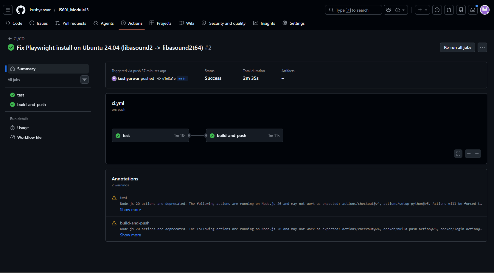
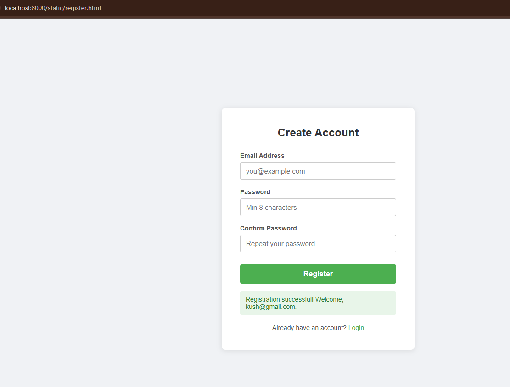
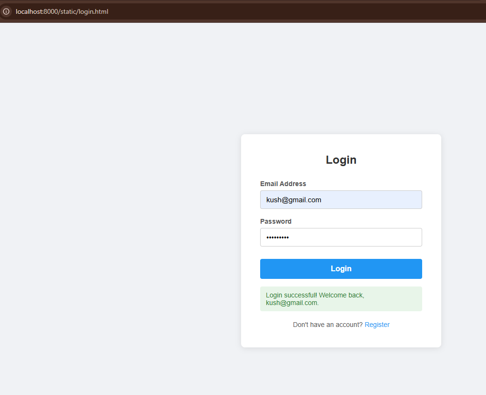
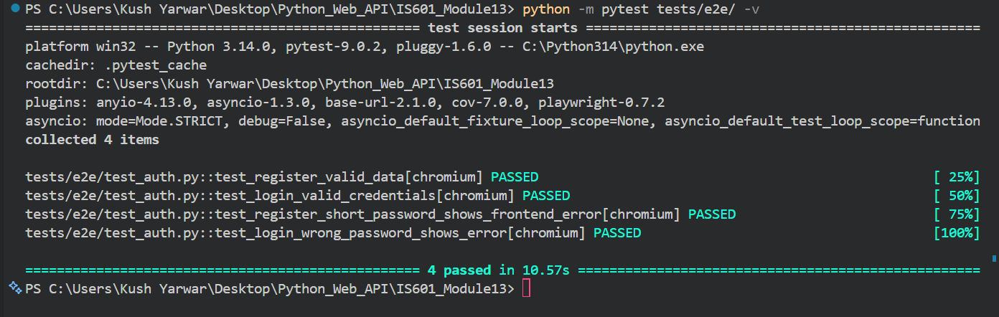

# IS601 Module 13 – JWT Login/Registration + Playwright E2E Testing

FastAPI back-end with JWT authentication, front-end registration and login pages, and Playwright E2E tests, all wired into a CI/CD pipeline that deploys to Docker Hub.

## Docker Hub

**Repository:** https://hub.docker.com/r/kushyarwar/is601-module13

**Image:** `kushyarwar/is601-module13:latest`

```bash
docker pull kushyarwar/is601-module13:latest
docker run -p 8000:8000 \
  -e DATABASE_URL=<your-postgres-url> \
  -e JWT_SECRET=<your-secret> \
  kushyarwar/is601-module13:latest
```

---

## Running the Front-End Locally

Start the full stack with Docker Compose:

```bash
docker-compose up --build
```

Then open your browser:

| Page | URL |
|------|-----|
| Register | http://localhost:8000/static/register.html |
| Login | http://localhost:8000/static/login.html |
| API Swagger Docs | http://localhost:8000/docs |
| pgAdmin | http://localhost:5050 (admin@admin.com / admin) |

The register page requires a valid email, a password of at least 8 characters, and a matching confirm password field. All validation runs in the browser before any API call is made. On success, the JWT token is stored in localStorage.

The login page accepts email and password. On success it stores the JWT and shows a success message. On wrong credentials it shows an error message without exposing whether the email exists.

---

## Running Integration Tests Locally

Tests use **SQLite** locally so no Postgres is required.

```bash
pip install -r requirements.txt
pytest tests/ --ignore=tests/e2e -v --cov=app --cov-report=term-missing
```

---

## Running Playwright E2E Tests Locally

```bash
# Install Playwright browser (first time only)
playwright install chromium

# Run all 4 E2E tests
pytest tests/e2e/ -v
```

The E2E test suite automatically starts a local SQLite-backed server on port 8001 before the tests run and shuts it down when they finish. No manual server setup is needed.

The 4 tests cover:
- Positive: register with valid data, confirm success message
- Positive: login with correct credentials, confirm success message
- Negative: register with short password, confirm front-end error shown (no server call)
- Negative: login with wrong password, confirm error message after 401 response

---

## API Endpoints

### Auth / User Routes

| Method | Path | Description |
|--------|------|-------------|
| POST | `/users/register` | Register — returns JWT + user info |
| POST | `/users/login` | Login with email + password — returns JWT |
| GET | `/users/` | List all users |
| GET | `/users/{id}` | Get user by ID |
| DELETE | `/users/{id}` | Delete user (cascades calculations) |

**Register request body:**
```json
{ "email": "you@example.com", "password": "yourpassword" }
```

**Register / Login response:**
```json
{ "token": "<jwt>", "message": "...", "user": { "id": 1, "username": "...", "email": "..." } }
```

### Calculation Routes (BREAD)

| Method | Path | Description |
|--------|------|-------------|
| GET | `/calculations/` | Browse all |
| GET | `/calculations/{id}` | Read one |
| PUT | `/calculations/{id}` | Edit (recomputes result) |
| POST | `/calculations/` | Add new |
| DELETE | `/calculations/{id}` | Delete |
| GET | `/calculations/join/all` | Calculations joined with username |

Supported operation types: `Add`, `Sub`, `Multiply`, `Divide`

---

## CI/CD Pipeline

GitHub Actions (`.github/workflows/ci.yml`):

1. **Integration tests** — spins up PostgreSQL 15, installs dependencies, runs `pytest` against a real Postgres DB
2. **Playwright E2E tests** — installs Chromium, runs 4 browser tests against a SQLite-backed local server
3. **Docker build and push** — on successful merge to `main`, builds and pushes `kushyarwar/is601-module13:latest`
4. **Trivy scan** — vulnerability scan on the pushed image

Required GitHub Secrets: `DOCKERHUB_USERNAME`, `DOCKERHUB_TOKEN`

---

## Screenshots

### GitHub Actions – CI/CD Workflow Passing


### Register Page – Success After Registration


### Login Page – Success After Login


### Playwright E2E Tests – All 4 Passing

